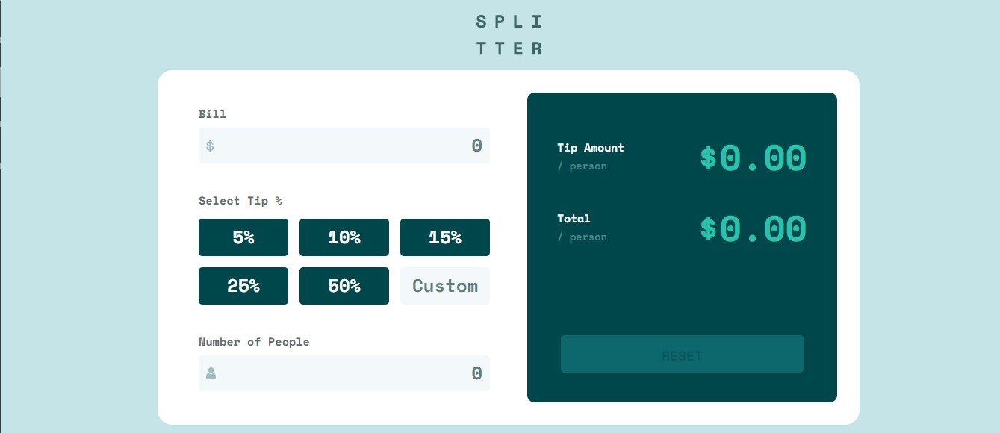

# Calculadora de Gorjetas

> **Considerando o número de pessoas a pagar a conta.**

Aqui você encontra requisitos detalhados do desafio, imagens da resolução, repositório e o live site no GitHub Pages.

## [**Live Site - Clique aqui**](https://lucaspicinini.github.io/front-end-mentor-challenges/tip-calculator-app-main/)

## Screenshot

### The challenge

Users should be able to:

- View the optimal layout for the app depending on their device's screen size
- See hover states for all interactive elements on the page
- Calculate the correct tip and total cost of the bill per person

### Built with

- Semantic HTML5 markup
- Flexbox
- CSS Grid
- JavaScript
