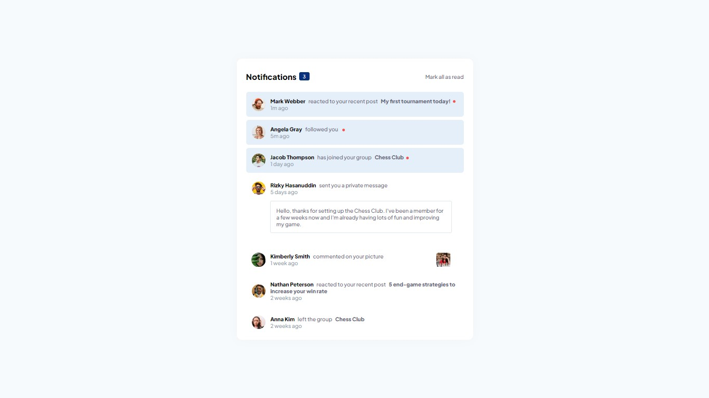

# Componente Interativo de Notificações

> **Treinando o estado reativo de componentes.**

Aqui você encontra requisitos detalhados do desafio, imagens da resolução, repositório e o live site no GitHub Pages.

## [**Live Site - Clique aqui**](https://lucaspicinini.github.io/front-end-mentor-challenges/notifications-page-main/)

## Screenshot

### The challenge

Users should be able to:

- Distinguish between "unread" and "read" notifications
- Select "Mark all as read" to toggle the visual state of the unread notifications and set the number of unread messages to zero
- View the optimal layout for the interface depending on their device's screen size
- See hover and focus states for all interactive elements on the page

### Built with

- Semantic HTML5 markup
- BEM methodology in the construction of CSS.
- JavaScript