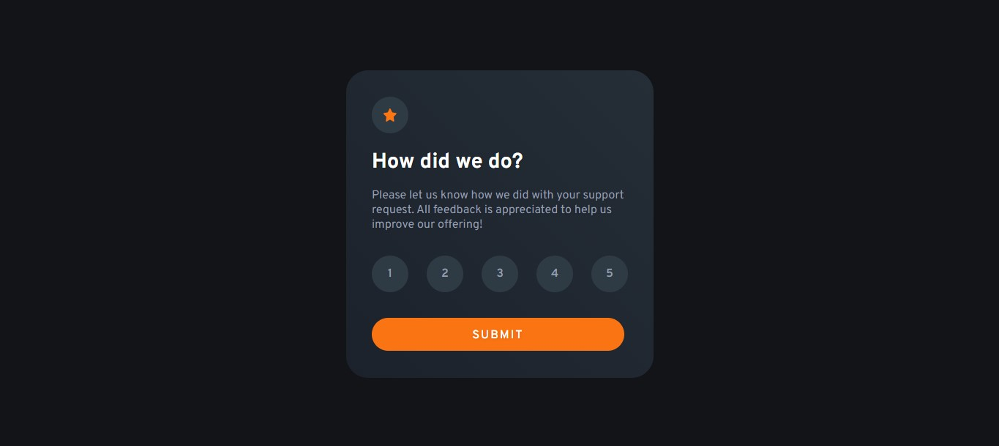

# Rating Component

> **Transição de componentes.**

Aqui você encontra requisitos detalhados do desafio, imagens da resolução, repositório e o live site no GitHub Pages.

## [**Live Site - Clique aqui**](https://lucaspicinini.github.io/front-end-mentor-challenges/interactive-rating-component-main/)

## Screenshot

### Built with

- Semantic HTML5 markup
- CSS Flexbox
- CSS Media Query
- BEM methodology in the construction of CSS.
- JavaScript